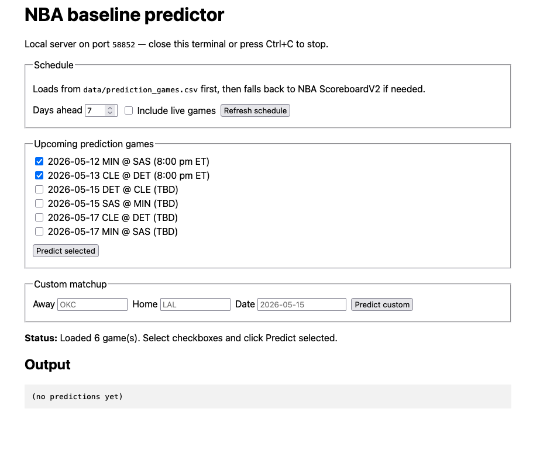
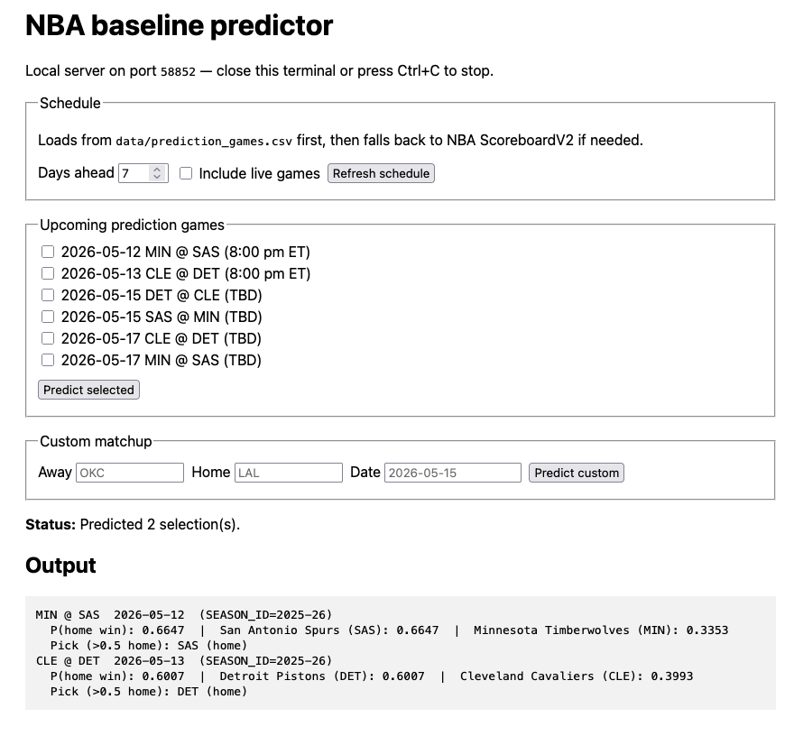

# NBA Win Baseline Predictor

A small NBA prediction project that downloads historical NBA results, builds pre-game rolling features, trains a logistic regression baseline model, and predicts upcoming matchups through either a command-line interface or a simple GUI.

The current version separates **completed games** from **future scheduled games** so the model trains only on games that already have results, while the GUI can still show future matchups for prediction.

---

## App Preview






---

## What This Project Does

The project has three main stages:

```text
1. Fetch data
2. Train model
3. Predict matchups
```

The key data split is:

```text
data/games.csv              completed games only, used for training
data/prediction_games.csv   future/unplayed games only, used by the GUI
data/schedule.csv           full normalized schedule
```

This matters because completed games have final labels like:

```text
HOME_WIN
HOME_PTS
AWAY_PTS
POINT_DIFF
```

Future games do not have these values yet, so they should not be used for training.

---

## Features

- Fetches NBA game data using `nba_api`
- Supports regular season, playoffs, and Play-In games
- Keeps training data and prediction schedule data separate
- Builds shifted rolling pre-game features
- Trains a logistic regression baseline model
- Supports command-line matchup prediction
- Supports a desktop GUI through Tkinter
- Supports a browser GUI fallback
- Loads upcoming games from `data/prediction_games.csv`
- Falls back to NBA ScoreboardV2 if the prediction schedule is missing or empty

---

## Project Structure

```text
nba-win-baseline/
├── artifacts/
│   └── baseline_logreg.pkl
├── data/
│   ├── games.csv
│   ├── prediction_games.csv
│   ├── schedule.csv
│   ├── raw_team_games.csv
│   └── raw_schedule.csv
├── docs/
│   └── app-screenshot.png
├── src/
│   ├── fetch_games.py
│   ├── features.py
│   ├── predict_gui_core.py
│   ├── scoreboard_schedule.py
│   └── train_baseline.py
├── fetch_data.py
├── train.py
├── predict.py
├── predict_gui.py
├── predict_gui_web.py
├── requirements.txt
└── README.md
```


| Path                            | Purpose                                                    |
| ------------------------------- | ---------------------------------------------------------- |
| `fetch_data.py`                 | Entry point for fetching NBA data                          |
| `train.py`                      | Entry point for training the model                         |
| `predict.py`                    | CLI prediction for one matchup                             |
| `predict_gui.py`                | Desktop GUI                                                |
| `predict_gui_web.py`            | Browser GUI fallback                                       |
| `src/fetch_games.py`            | Fetches and normalizes completed games and scheduled games |
| `src/features.py`               | Builds rolling pre-game features                           |
| `src/train_baseline.py`         | Trains and evaluates the baseline model                    |
| `src/predict_gui_core.py`       | Shared prediction GUI logic                                |
| `src/scoreboard_schedule.py`    | ScoreboardV2 fallback schedule fetcher                     |
| `data/games.csv`                | Completed games only                                       |
| `data/prediction_games.csv`     | Future games only                                          |
| `data/schedule.csv`             | Full normalized schedule                                   |
| `artifacts/baseline_logreg.pkl` | Trained model artifact                                     |


---

## Setup

From the project root:

```bash
python3 -m venv .venv
source .venv/bin/activate
pip install -r requirements.txt
```

On Windows:

```bash
python -m venv .venv
.venv\Scripts\activate
pip install -r requirements.txt
```

Required packages include:

```text
nba_api
pandas
numpy
scikit-learn
```

---

## Full Workflow

Run these commands from the project root.

### 1. Fetch NBA Data

```bash
python fetch_data.py \
  --nba-season-from 2017-18 \
  --nba-season-to 2025-26 \
  --nba-as-of 2026-05-12
```

You can also run it on one line:

```bash
python fetch_data.py --nba-season-from 2017-18 --nba-season-to 2025-26 --nba-as-of 2026-05-12
```

This creates:

```text
data/games.csv
data/prediction_games.csv
data/schedule.csv
data/raw_team_games.csv
data/raw_schedule.csv
```

### 2. Train the Model

```bash
python train.py
```

This trains on:

```text
data/games.csv
```

and creates:

```text
artifacts/baseline_logreg.pkl
```

### 3. Predict One Custom Matchup

```bash
python predict.py --home Lakers --away Thunder --game-date 2026-05-20
```

Example with abbreviations:

```bash
python predict.py --home BOS --away NYK --game-date 2026-05-15
```

### 4. Run the GUI

```bash
python predict_gui.py
```

If Tkinter is unavailable, run the browser GUI:

```bash
python predict_gui_web.py
```

---

## Data Files Explained

### `data/games.csv`

This file contains only completed games.

It is used for:

```text
training
feature history
command-line predictions
GUI predictions
```

Typical columns:

```text
GAME_ID
GAME_DATE
SEASON_ID
HOME_TEAM_ID
AWAY_TEAM_ID
HOME_ABBR
AWAY_ABBR
HOME_PTS
AWAY_PTS
HOME_WIN
POINT_DIFF
```

The model trains only on this file.

---

### `data/prediction_games.csv`

This file contains future or unplayed scheduled games.

It is used by:

```text
predict_gui.py
predict_gui_web.py
src/predict_gui_core.py
```

Typical columns:

```text
GAME_ID
GAME_DATE
SEASON_ID
GAME_TYPE
HOME_TEAM_ID
AWAY_TEAM_ID
HOME_ABBR
AWAY_ABBR
GAME_STATUS
GAME_STATUS_TEXT
IS_PREDICTION_ROW
```

These rows should not be used for training because the final scores are not available yet.

---

### `data/schedule.csv`

This is the full normalized schedule.

It can contain:

```text
completed games
future games
playoff games
Play-In games
regular season games
```

It is useful for debugging and checking what the NBA schedule endpoint returned.

---

## How the Model Works

The model is a simple baseline classifier.

It uses:

```text
historical completed games
rolling team features
rest-day style features
home/away context
```

The training pipeline:

```text
data/games.csv
    -> add_shifted_roll_features()
    -> feature_matrix()
    -> StandardScaler()
    -> LogisticRegression()
    -> artifacts/baseline_logreg.pkl
```

The prediction pipeline:

```text
data/games.csv
    -> add one temporary synthetic future matchup row
    -> build shifted rolling features
    -> score the synthetic row
    -> return home and away win probabilities
```

The synthetic prediction row is created only in memory. It is not written back to `games.csv`.

---

## GUI Behavior

The GUI loads upcoming games using this priority:

```text
1. data/prediction_games.csv
2. NBA ScoreboardV2 fallback
```

The preferred flow is:

```text
fetch_data.py
    -> creates prediction_games.csv

predict_gui.py
    -> loads prediction_games.csv
    -> displays upcoming games
    -> user selects games
    -> predict_matchup() scores selected games
```

If `prediction_games.csv` is missing or empty, the GUI attempts to use the ScoreboardV2 fallback for near-term games.

---

## Command Reference

### Fetch

```bash
python fetch_data.py --nba-season-from 2017-18 --nba-season-to 2025-26 --nba-as-of 2026-05-12
```

Useful flags:


| Flag                        | Purpose                                          |
| --------------------------- | ------------------------------------------------ |
| `--nba-season-from 2017-18` | First season to fetch                            |
| `--nba-season-to 2025-26`   | Last season to fetch                             |
| `--nba-as-of YYYY-MM-DD`    | Date used to decide which games are future games |
| `--no-playoffs`             | Exclude playoff games                            |
| `--no-playin`               | Exclude Play-In games                            |


### Train

```bash
python train.py
```

### Predict CLI

```bash
python predict.py --home HOME_TEAM --away AWAY_TEAM --game-date YYYY-MM-DD
```

Examples:

```bash
python predict.py --home Lakers --away Thunder --game-date 2026-05-20
python predict.py --home BOS --away NYK --game-date 2026-05-15
```

### Desktop GUI

```bash
python predict_gui.py
```

### Browser GUI

```bash
python predict_gui_web.py
```

---

## Team Input Rules

For `predict.py`, `--home` and `--away` accept:

```text
abbreviation
nickname
full team name
unique partial match
```

Examples:

```bash
python predict.py --home LAL --away OKC --game-date 2026-05-20
python predict.py --home Lakers --away Thunder --game-date 2026-05-20
python predict.py --home "Los Angeles Lakers" --away "Oklahoma City Thunder" --game-date 2026-05-20
```

If the team name is unknown or ambiguous, the script prints valid NBA team names.

---

## Adding a Screenshot to the README

Create a folder:

```bash
mkdir -p docs
```

Add your screenshot:

```text
docs/app-screenshot.png
```

Then keep this Markdown in the README:

```markdown

```

If the image does not show on GitHub, check:

```text
1. The file is committed
2. The path is correct
3. The filename capitalization matches exactly
```

---

## Troubleshooting

### 1. `zsh: command not found: --nba-season-from`

This happens when a multi-line command is copied incorrectly.

Wrong:

```bash
python fetch_data.py \\
  --nba-season-from 2017-18
```

Correct:

```bash
python fetch_data.py \
  --nba-season-from 2017-18
```

The backslash must be a single `\` at the very end of the line.

Safest option: run it on one line.

```bash
python fetch_data.py --nba-season-from 2017-18 --nba-season-to 2025-26 --nba-as-of 2026-05-12
```

---

### 2. `unrecognized arguments: \`

This is the same shell issue as above. Remove the extra backslash or run the command on one line.

---

### 3. `ValueError: Found array with 0 sample(s)`

This means the training script found zero valid training rows.

Common causes:

```text
data/games.csv is empty
only one season was fetched
future games were accidentally mixed into games.csv
the latest season was held out as test, leaving no training seasons
```

Check your training file:

```bash
python -c "import pandas as pd; df=pd.read_csv('data/games.csv'); print(df.shape); print(df['SEASON_ID'].value_counts().sort_index())"
```

Fix by fetching multiple seasons:

```bash
python fetch_data.py --nba-season-from 2017-18 --nba-season-to 2025-26
python train.py
```

---

### 4. `Cannot compare tz-naive and tz-aware datetime-like objects`

This means Pandas is comparing timezone-aware NBA API dates with timezone-naive local dates.

The fixed fetch logic normalizes these dates. If you see this error, make sure your current `src/fetch_games.py` includes timezone normalization before filtering future games.

Then rerun:

```bash
python fetch_data.py --nba-season-from 2017-18 --nba-season-to 2025-26 --nba-as-of 2026-05-12
```

---

### 5. `prediction_games.csv` is empty

First check the file:

```bash
python -c "import pandas as pd; df=pd.read_csv('data/prediction_games.csv'); print(df.shape); print(df.head())"
```

Possible causes:

```text
There are no future NBA games in the selected season range
--nba-as-of is after the scheduled games
future games are being marked as completed
the schedule endpoint returned no future rows
```

Try setting `--nba-as-of` earlier:

```bash
python fetch_data.py --nba-season-from 2025-26 --nba-season-to 2025-26 --nba-as-of 2026-05-01
```

Also inspect the full schedule:

```bash
python -c "import pandas as pd; df=pd.read_csv('data/schedule.csv'); print(df[['GAME_DATE','AWAY_ABBR','HOME_ABBR','GAME_STATUS_TEXT']].tail(30))"
```

---

### 6. GUI opens but shows no upcoming games

Check if `prediction_games.csv` has rows:

```bash
python -c "import pandas as pd; df=pd.read_csv('data/prediction_games.csv'); print(df[['GAME_DATE','AWAY_ABBR','HOME_ABBR','GAME_STATUS_TEXT']].head(20))"
```

If it is empty, rerun the fetch command.

If it has rows but the GUI is empty, make sure `src/predict_gui_core.py` is loading `prediction_games.csv` before ScoreboardV2.

---

### 7. `ImportError: cannot import name 'predict_matchup' from 'predict'`

This means `predict.py` is missing the reusable `predict_matchup()` function.

Check:

```bash
python -c "from predict import predict_matchup, resolve_user_team; print('predict import works')"
```

If this fails, restore the version of `predict.py` that includes:

```python
def predict_matchup(...):
    ...
```

The GUI depends on this function.

---

### 8. `Missing artifacts/baseline_logreg.pkl`

You need to train the model first.

```bash
python train.py
```

Then rerun:

```bash
python predict_gui.py
```

---

### 9. `Missing data/games.csv`

You need to fetch data first.

```bash
python fetch_data.py --nba-season-from 2017-18 --nba-season-to 2025-26
```

Then train:

```bash
python train.py
```

---

### 10. Tkinter is missing

If `predict_gui.py` cannot open the desktop GUI, use the browser version:

```bash
python predict_gui_web.py
```

On macOS with Homebrew Python, you may need:

```bash
brew install python-tk
```

or a version-specific package such as:

```bash
brew install python-tk@3.14
```

---

### 11. NBA API request fails or hangs

The NBA Stats API can be sensitive to network conditions.

Try:

```text
turn off VPN
try a different network
wait and rerun
reduce the season range
rerun only the latest season
```

Example:

```bash
python fetch_data.py --nba-season-from 2025-26 --nba-season-to 2025-26
```

---

### 12. Feature column mismatch

If you see an error like:

```text
Feature column mismatch. Model expects ..., got ...
```

then the feature code changed after the model was trained.

Fix:

```bash
python train.py
```

Then rerun prediction.

---

## Development Notes

### Why `games.csv` and `prediction_games.csv` are separate

The model should not train on future games because they do not have real labels.

Good:

```text
games.csv -> train.py
prediction_games.csv -> predict_gui.py
```

Bad:

```text
prediction_games.csv -> train.py
```

### Why future games use placeholder scores only during prediction

`predict_matchup()` creates a synthetic future row with placeholder values in memory. Because the rolling features are shifted, the synthetic row's own fake score should not leak into its prediction features.

The placeholder row is never saved to disk.

---

## Quick Sanity Checks

Check completed games:

```bash
python -c "import pandas as pd; df=pd.read_csv('data/games.csv'); print(df.shape); print(df.tail())"
```

Check future prediction games:

```bash
python -c "import pandas as pd; df=pd.read_csv('data/prediction_games.csv'); print(df.shape); print(df[['GAME_DATE','AWAY_ABBR','HOME_ABBR','GAME_STATUS_TEXT']].head(20))"
```

Check full schedule:

```bash
python -c "import pandas as pd; df=pd.read_csv('data/schedule.csv'); print(df.shape); print(df.tail())"
```

Check trained model artifact:

```bash
python -c "import pickle; print(pickle.load(open('artifacts/baseline_logreg.pkl','rb')).keys())"
```

Check prediction import:

```bash
python -c "from predict import predict_matchup, resolve_user_team; print('predict import works')"
```

Run a quick prediction:

```bash
python predict.py --home BOS --away NYK --game-date 2026-05-15
```

---

## Current End-to-End Flow

```text
python fetch_data.py
    -> data/games.csv
    -> data/prediction_games.csv
    -> data/schedule.csv

python train.py
    -> artifacts/baseline_logreg.pkl

python predict_gui.py
    -> loads data/prediction_games.csv
    -> scores selected games using predict_matchup()

python predict.py
    -> scores one custom matchup from CLI
```

---

## Limitations

- This is a baseline model, not a production betting model.
- Predictions depend on the quality and coverage of the fetched historical data.
- NBA API availability can vary by network.
- The model does not account for injuries, player rotations, betting lines, travel difficulty, or real-time roster changes.
- Playoff context is included through historical game results, but the model is still intentionally simple.
